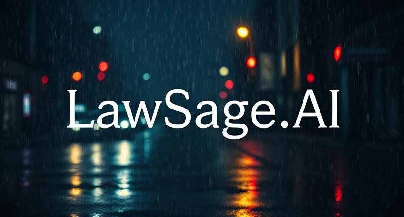

# **LawSage.AI**  
**Empowering Legal Professionals with AI-Driven Insights**


 

---

## **About LawSage.AI**

**LawSage.AI** is a cutting-edge AI-powered platform designed to simplify and revolutionize the way legal professionals interact with documents. This project was developed as an academic coursework project for *Intelligent Model Design using AI*, showcasing advanced AI techniques to streamline legal workflows:  
- **Document Summarization**: Extract concise summaries of lengthy legal documents.  
- **Simplified Insights**: Simplify legal jargon for better understanding.  
- **Legal Research Assistance**: Provide answers and insights tailored to legal queries.  

Whether you're a lawyer, paralegal, or student, **LawSage.AI** is your partner in navigating the complexities of the legal domain.  

---

## **Key Features**
- **Upload & Extract**: Upload legal documents (PDF) and extract text with ease.  
- **Intelligent Summarization**: Generate summaries using the **Legal-Pegasus** model.  
- **Simplification at a Click**: Create simplified summaries with the **LegalBERT-BART** model.  
- **Research on Demand**: Use advanced legal models like **Indian Legal Assistant** to answer queries and provide structured legal insights.  
- **User-Friendly Design**: Modern and intuitive interface built with **Flask** and responsive web technologies.  

---

## **Tech Stack**

| **Technology**      | **Usage**                        |  
|----------------------|----------------------------------|  
| Python              | Backend logic & AI models       |  
| Flask               | Web framework                   |  
| HTML/CSS/JavaScript | Frontend interface              |  
| PyTorch & TensorFlow| Model training and integration  |  
| Hugging Face Models | Advanced AI models for NLP      |  

---

## **Folder Structure**
LawSage.AI/ ├── backend/ # Backend logic and APIs ├── frontend/ # User interface │ ├── static/ # Static assets (CSS, JS) │ ├── templates/ # HTML templates ├── models/ # Pretrained AI models ├── data/ # Training datasets └── README.md # Project overview


---

## **How It Works**

1. **Upload a Document**: Start by uploading a legal document (PDF).  
2. **Summarization**:  
   - **Step 1**: Generate a detailed summary using **Legal-Pegasus**.  
   - **Step 2**: Create a simplified version using **LegalBERT-BART** (optional).  
3. **Legal Research Assistance**: Ask complex legal queries and receive structured answers using advanced legal AI models.  

---

## **Models Used**

| **Model Name**                           | **Purpose**                                  |  
|------------------------------------------|----------------------------------------------|  
| `nsi319/legal-pegasus`                   | Legal document summarization                |  
| `MikaSie/LegalBERT_BART_fixed_V1`        | Simplified legal summaries                  |  
| `varma007ut/Indian_Legal_Assistant`      | General legal query resolution              |  
| `Ayush12a/llama3.1_finetuned_on_indian_legal_dataset` | Indian law-specific queries        |  
| `microsoft/Phi-3.5-mini-instruct`        | Natural legal language understanding         |  

---

## **Installation & Setup**

1. Clone the repository:
   ```bash
   git clone https://github.com/your-username/LawSage.AI.git
   cd LawSage.AI
